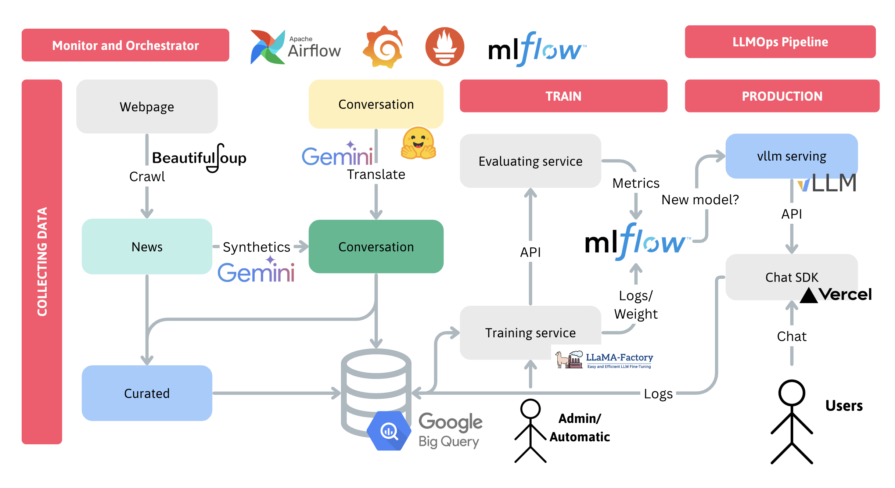

## TRAINING CLUSTER

For API documentation, check [here](api/README.md)

## Architecture Diagrams

## Setup

You can run the training server under `Docker` image.

Or manually build it via `install.sh` script.

## Explain

This the training cluser, a major component of a MLOps Pipeline to train and evaluate **Large Language Model**. 

> The main concept is using common training tools (LLaMA-Factory), create 2 separate thread for training (command line) and monitor (python), and the monitor will constaintly check the training process via `trainer_log.jsonl`.

### Components:
- **Collecting data**: Connect and download the data from the DataLake.
- **Preprocess**: Download model, Lora weight and setup config file.
- **Monitor**: Listening to the log from [LLaMA-Factory](https://github.com/hiyouga/LLaMA-Factory) training tool, upload the model weight to model registry and send evaluation request.
- **Training CLI**: Monitoring the training and monitoring behaviour 

